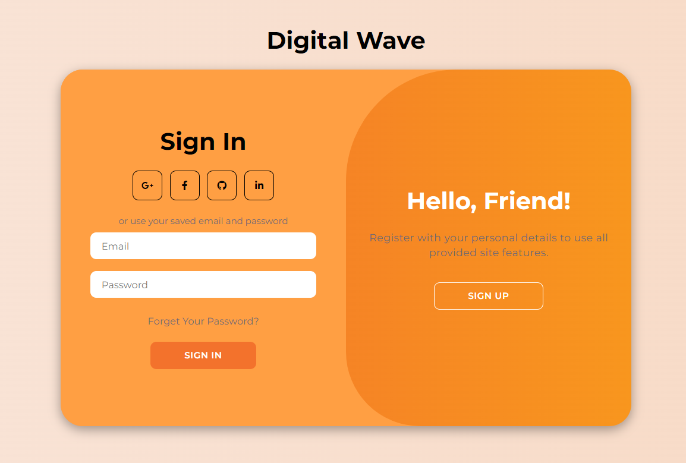

# Login-Page

## Table of Contents
1. [Overview](#Overview)
2. [Features](#Features)
    - Create Account
    - Social Login
    - Responsive Design
4. [Technologies Used](#Technologies-Used)
    - HTML
    - CSS
    - JavaScript
6. [How to Use](#How-to-Use)
7. [Project Struture](#Project-Struture)
    - index.html
    - style.css
    - script.js
9. [Credits](#Credits)
10. [Vercel Deployment](#Vercel-Deployment)
    - Accessing the deployed web application
12. [Image Visual](#Image-Visual)

## Overview

This project is a simple login page developed using HTML, CSS, and JavaScript. It provides functionality for users to create a new account or sign in using their existing credentials.

## Features

- Create Account: Users can fill in their name, email, and password to create a new account.
- Social Login: Options for signing up or logging in using social media accounts such as Google, Facebook, GitHub, and LinkedIn are available.
- Responsive Design: The login page is designed to be responsive, ensuring optimal viewing and interaction experience across a wide range of devices.

## Technologies Used

- HTML: Provides the structure and content of the login page.
- CSS: Defines the styles and layout of the page, including colors, fonts, and animations.
- JavaScript: Implements interactivity such as toggling between sign-up and sign-in forms.

## How to Use

1. Clone the repository to your local machine.
2. Open the index.html file in your web browser.
3. Fill in the required information to create a new account or sign in using existing credentials.
    - Optionally, use the social login options to sign up or log in with your social media accounts.

## Project Structure

- index.html: Contains the HTML markup for the login page layout and structure.
- style.css: Defines the styles, the use of CSS Flexbox, CSS Keyframes, CSS Transition for animations and layout for the login page using CSS.
- script.js: Implements interactivity and functionality using JavaScript, such as toggling between sign-up and sign-in forms.

## Credits

- Font Awesome: Used for the social media icons.
- Google Fonts: Provides the Montserrat font used in the project.

## Vercel Deployment

- Accessing the deployed web application

[(https://login-page-nyuprc63b-damienb123s-projects.vercel.app/?#)](https://login-page-nyuprc63b-damienb123s-projects.vercel.app/?#)

## Image Visual

